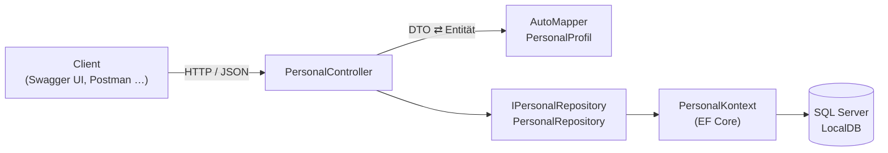

# StaffManager – REST-API zur Personalverwaltung


Eine ASP.NET Core Web API, mit der sich Mitarbeiter anlegen, abrufen, ändern und löschen lassen (CRUD). Die Daten speichert Entity Framework Core in einer SQL-Server-Datenbank. Über die Swagger-Oberfläche lässt sich die API direkt im Browser ausprobieren.

Das Projekt ist ein Lernprojekt (Projekt 3) und zeigt den Aufbau einer sauber geschichteten Web API mit Controller, DTOs, AutoMapper, Repository-Pattern und EF Core.

## Inhalt

- [Funktionen](#funktionen)
- [Technologien](#technologien)
- [Architektur](#architektur)
- [Projektstruktur](#projektstruktur)
- [Schnellstart](#schnellstart)
- [Konfiguration](#konfiguration)
- [API-Referenz](#api-referenz)
- [Datenmodell](#datenmodell)
- [Designentscheidungen](#designentscheidungen)
- [Hinweise](#hinweise)
- [Lernfortschritt](#lernfortschritt)
- [Autor](#autor)

## Funktionen

- **CRUD-Endpunkte** für Mitarbeiter unter `/api/Personal`
- **DTOs** trennen die API von der Datenbank-Entität: Clients können nur die vorgesehenen Felder senden (Schutz vor Over-Posting).
- **AutoMapper-Profil** für die Umwandlung zwischen DTOs und Entität, inklusive des berechneten Felds `VollerName`
- **Repository-Pattern:** Der Controller kennt nur `IPersonalRepository`, nicht EF Core.
- **Validierung** mit Data Annotations und deutschen Fehlermeldungen; ungültige Anfragen beantwortet `[ApiController]` automatisch mit `400 Bad Request`.
- **Location-Header** bei `201 Created`, der direkt auf den neu angelegten Mitarbeiter zeigt
- **Code-First-Migrationen** mit EF Core und SQL Server LocalDB
- **Swagger UI** zum Testen im Browser (in der Entwicklungsumgebung)

## Technologien

| Bereich | Technologie | Version |
| --- | --- | --- |
| Laufzeit | .NET | 10.0 |
| Framework | ASP.NET Core Web API | 10.0 |
| Datenzugriff | Entity Framework Core (SqlServer, Tools) | 10.0.12 |
| Datenbank | SQL Server Express LocalDB | – |
| Objekt-Mapping | AutoMapper | 16.2.0 |
| API-Dokumentation | Swashbuckle.AspNetCore (Swagger) | 10.2.3 |
| Entwicklungsumgebung | Visual Studio 2026 | – |

## Architektur



Der Controller nimmt ein DTO entgegen, wandelt es mit AutoMapper in die Entität `Mitarbeiter` um und übergibt sie dem Repository. Das Repository schreibt die Änderungen über den `PersonalKontext` (EF Core) in die Datenbank. Für die Antwort wandelt AutoMapper die Entität wieder in ein DTO um.

## Projektstruktur

```text
StaffManager/
├── PersonManager.slnx                     # Projektmappe
└── PersonalApi/                           # ASP.NET Core Web API
    ├── Controllers/
    │   └── PersonalController.cs          # Endpunkte unter /api/Personal
    ├── DTOs/
    │   ├── MitarbeiterErstellenDto.cs     # Eingabe für POST
    │   ├── MitarbeiterAktualisierenDto.cs # Eingabe für PUT
    │   └── MitarbeiterAntwortDto.cs       # Ausgabe für GET und POST
    ├── Datenbank/
    │   └── PersonalKontext.cs             # EF Core DbContext
    ├── Migrations/                        # EF Core Code-First-Migrationen
    ├── Modelle/
    │   └── Mitarbeiter.cs                 # Entität (Tabelle „Mitarbeiter“)
    ├── Repositories/
    │   ├── IPersonalRepository.cs         # Schnittstelle für den Datenzugriff
    │   └── PersonalRepository.cs          # Umsetzung mit EF Core
    ├── 2uordnung/
    │   └── PersonalProfil.cs              # AutoMapper-Profil
    ├── Properties/
    │   └── launchSettings.json            # Startprofile http und https
    ├── Program.cs                         # DI-Container, Middleware, Swagger
    ├── appsettings.json                   # Verbindungszeichenfolge, Logging
    └── LIESMICH.md                        # Lerntagebuch
```

## Schnellstart

### Voraussetzungen

- [.NET 10 SDK](https://dotnet.microsoft.com/download/dotnet/10.0)
- SQL Server Express LocalDB (als Komponente über den Visual Studio Installer installierbar)
- Visual Studio 2026 **oder** die .NET-CLI

### Mit Visual Studio

1. Repository klonen und `PersonManager.slnx` öffnen.
2. **Extras → NuGet-Paket-Manager → Paket-Manager-Konsole** öffnen und die Datenbank anlegen:

   ```powershell
   Update-Database
   ```

3. Das Startprofil **https** auswählen und mit **F5** starten.
4. Im Browser <https://localhost:7294/swagger> öffnen.

### Mit der .NET-CLI

```bash
git clone https://github.com/Azlan-Ainto/StaffManager.git
cd StaffManager

# Einmalig: EF-Core-Werkzeuge und HTTPS-Entwicklungszertifikat
dotnet tool install --global dotnet-ef
dotnet dev-certs https --trust

# Datenbank aus den Migrationen erstellen
dotnet ef database update --project PersonalApi

# API starten
dotnet run --project PersonalApi --launch-profile https
```

Anschließend <https://localhost:7294/swagger> im Browser öffnen. Der Browser startet nicht automatisch, weil `launchBrowser` in beiden Startprofilen ausgeschaltet ist.

## Konfiguration

Die Verbindungszeichenfolge steht in `PersonalApi/appsettings.json`:

```json
"ConnectionStrings": {
  "PersonalDatenbankVerbindung": "Server=(localdb)\\MSSQLLocalDB;Database=PersonalApiDb;Trusted_Connection=True;"
}
```

Standardmäßig nutzt die API die Datenbank **PersonalApiDb** in LocalDB mit Windows-Authentifizierung. Für einen anderen SQL Server diesen Wert anpassen. Zugangsdaten mit Passwort gehören nicht ins Repository, sondern zum Beispiel in die [User Secrets](https://learn.microsoft.com/aspnet/core/security/app-secrets).

| Startprofil | Adressen |
| --- | --- |
| `https` | <https://localhost:7294> und <http://localhost:5015> |
| `http` | <http://localhost:5015> |

## API-Referenz

Basis-URL: `https://localhost:7294/api/Personal`

| Methode | Route | Beschreibung | Erfolg | Fehler |
| --- | --- | --- | --- | --- |
| `GET` | `/api/Personal` | Alle Mitarbeiter abrufen | `200 OK` | – |
| `GET` | `/api/Personal/{arbeiterId}` | Einen Mitarbeiter abrufen | `200 OK` | `404 Not Found` |
| `POST` | `/api/Personal` | Mitarbeiter anlegen | `201 Created` | `400 Bad Request` |
| `PUT` | `/api/Personal/{arbeiterId}` | Mitarbeiter aktualisieren | `204 No Content` | `400 Bad Request`, `404 Not Found` |
| `DELETE` | `/api/Personal/{arbeiterId}` | Mitarbeiter löschen | `204 No Content` | `404 Not Found` |

### Mitarbeiter anlegen

```http
POST /api/Personal
Content-Type: application/json

{
  "vorname": "Max",
  "nachname": "Mustermann",
  "position": "Entwickler"
}
```

Antwort `201 Created` mit dem Header `Location: https://localhost:7294/api/Personal/1`:

```json
{
  "mitarbeiterId": 1,
  "vollerName": "Max Mustermann",
  "position": "Entwickler",
  "einstellungsdatum": "2026-09-15T21:22:48.4421985+02:00"
}
```

- `vorname` und `nachname` sind Pflichtfelder, `position` ist optional.
- `einstellungsdatum` setzt die API beim Anlegen automatisch.
- `vollerName` setzt AutoMapper aus Vor- und Nachname zusammen.

### Mitarbeiter aktualisieren

```http
PUT /api/Personal/1
Content-Type: application/json

{
  "mitarbeiterId": 1,
  "vorname": "Max",
  "nachname": "Mustermann",
  "position": "Teamleiter"
}
```

Die `mitarbeiterId` im Body muss mit der ID in der URL übereinstimmen, sonst antwortet die API mit `400 Bad Request`. Bei Erfolg kommt `204 No Content` ohne Inhalt zurück.

### Fehlerantworten

Ungültige Eingaben (hier ein leerer Body `{}`) beantwortet die API mit `400 Bad Request` im Format *Problem Details*:

```json
{
  "type": "https://tools.ietf.org/html/rfc9110#section-15.5.1",
  "title": "One or more validation errors occurred.",
  "status": 400,
  "errors": {
    "Vorname": ["Vorname ist ein Pflichtfeld."],
    "Nachname": ["Nachname ist ein Pflichtfeld."]
  },
  "traceId": "00-…"
}
```

Existiert eine ID nicht, antwortet die API mit `404 Not Found` und einer Meldung wie `"Mitarbeiter mit ID 999 existiert nicht."`.

## Datenmodell

Tabelle **Mitarbeiter** (angelegt durch die Migration `InitialeApiErstellung`):

| Spalte | Typ | Beschreibung |
| --- | --- | --- |
| `MitarbeiterId` | `int` | Primärschlüssel, wird von SQL Server fortlaufend vergeben |
| `Vorname` | `nvarchar(max)` | Pflichtfeld |
| `Nachname` | `nvarchar(max)` | Pflichtfeld |
| `Position` | `nvarchar(max)` | Berufsbezeichnung, leer erlaubt |
| `Einstellungsdatum` | `datetime2` | Zeitpunkt der Anlage |

## Designentscheidungen

- **DTOs statt Entität:** Beim Anlegen können Clients weder `MitarbeiterId` noch `Einstellungsdatum` setzen. Außerdem kann sich die Datenbankstruktur ändern, ohne dass sich der API-Vertrag ändert.
- **Repository-Pattern:** Der Controller hängt nur von `IPersonalRepository` ab. So lässt sich der Datenzugriff austauschen und der Controller mit einer Fake-Implementierung testen.
- **Scoped-Lebensdauer:** Repository und `PersonalKontext` entstehen pro HTTP-Anfrage neu. Jede Anfrage arbeitet so mit einem eigenen `DbContext`, der nicht zwischen Anfragen geteilt wird.
- **Speichern vor der Antwort:** Die `MitarbeiterId` vergibt SQL Server erst beim Speichern. Deshalb erstellt der Controller die Antwort und den Location-Header erst nach `Aktualisieren_Async()`.
- **`SuppressAsyncSuffixInActionNames = false`:** ASP.NET Core entfernt sonst die Endung `Async` aus den Aktionsnamen. Dann fände `CreatedAtAction(nameof(Mitarbeiter_Abrufen_Async), …)` keine passende Route, und `POST` endete mit einem Fehler 500.

## Hinweise

- **AutoMapper-Lizenz:** Die verwendete AutoMapper-Version ist kommerziell lizenziert. Ohne Lizenzschlüssel ist sie für Entwicklung und Tests erlaubt; beim Start erscheint dazu eine Warnung im Log. Für den Produktiveinsatz ist eine Lizenz nötig.
- **Swagger** ist nur in der Umgebung `Development` aktiv. Beide Startprofile setzen `ASPNETCORE_ENVIRONMENT=Development`.

## Lernfortschritt

Die einzelnen Lernschritte (Tag 13 bis 16: REST-Grundlagen, EF Core, DTOs, AutoMapper) sind in [PersonalApi/LIESMICH.md](PersonalApi/LIESMICH.md) dokumentiert.

## Autor

**Azlan Ainto** – [GitHub: Azlan-Ainto](https://github.com/Azlan-Ainto)
